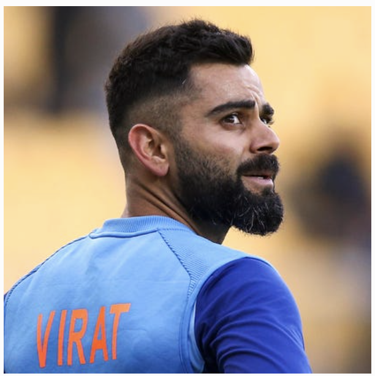

# Introducting me

My name is **Uday Dhawan**. I am a Junior at *UC San Diego* studying Computer Science and Management Science. 

My favorite quote is 
> A journey of a thousand miles begins with a single step. 

## Technical Knowledge

I have some basic knowledge of programming languages such as C++, Java and Python. For example:
`cout << "Hello World" << endl;`

You can view my LinkedIn Profile [here](https://www.linkedin.com/in/uday-dhawan-92aaa2179/).

[section name](Technical Knowledge)

[Link to Readme file](README.md)

My hobbies include:
1. Chess
2. Cricket
3. Gaming(PS4)

I can also play various instruments such as:
- Guitar
- Keyboard

This is my task list 

- [ ] Complete my bachelor's
- [ ] Apply to grad school
- [ ] Get a job

One of my role models is Virat Kohli.

